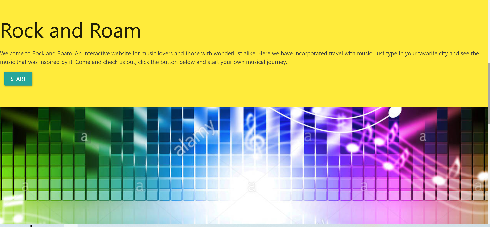
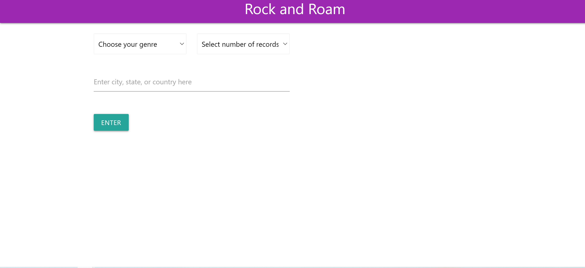
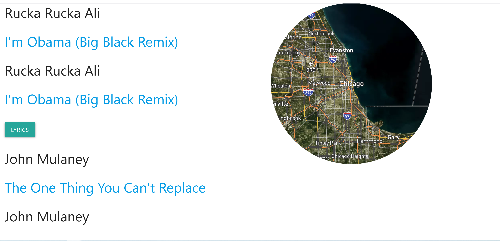

# musiclocations
## Table of contents
 * [Submission files](#Submission-files)
 * [Description](#Description)
 * [Usage Instructions](#Usage-Instructions)
 * [Acknowledgements](#Acknowledgements)
 * [Contributers](#Contributers)
 * [License](#License)

## Submission files

* README.md
* index.html
* style.css
* script.js

 ### Project 1
 ### Group 4

* [github repo](https://github.com/glynismullankwok/musiclocations)
 * Deployed: [url](#)

## Description

Rock and Roam is an interactive website where users can enter the name of a city/state/country and get results of songs about the place. The results incluce lines to the lyrics, a map to the place, and a photo of the city.

## Usage Instructions

1. Home page 

2. Search music page

3. Search music by genre, number of records and city

4. Searched city image response

5. Searched music response and map

## Acknowledgements

* https://www.makeareadme.com/ 
* Materialize
* MusixMatch APIs
* Pixabey API
* Mapbox API

## Contributers
1. [David Roman](https://github.com/Droman09)
2. [Negasi Michael](https://github.com/negasimichael)
3. [Jamie Carlstone](https://github.com/jdcar)
4. [Glynis Mullan-Kwok](https://github.com/glynismullankwok)

## License
### This application is licensed under .
